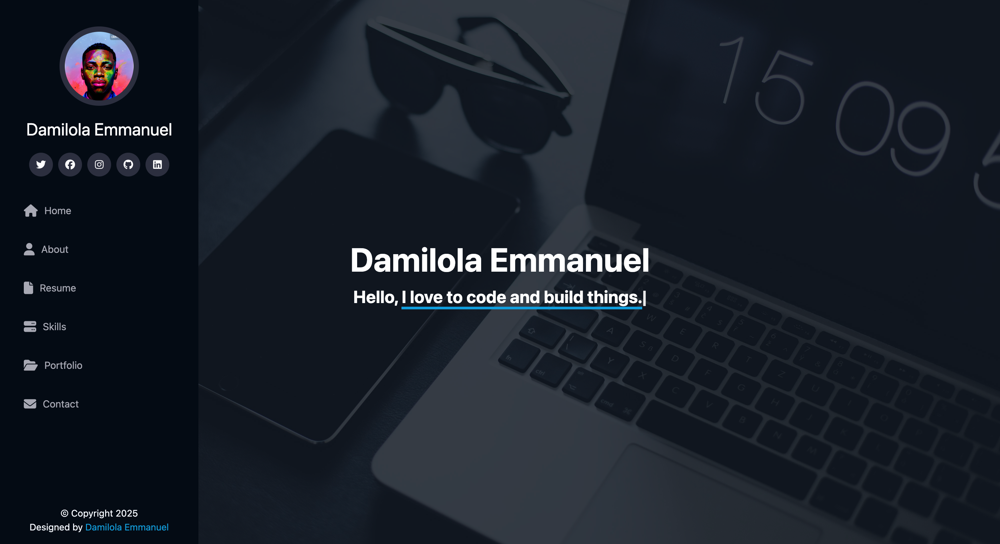

# Personal Portfolio - Damilola Emmanuel

This is a personal portfolio website built using **React** for the frontend and **Node.js** for the backend. The portfolio showcases my skills, projects, and experiences as a **Full Stack Web Developer**.



## Features
- **Responsive Design:** Works seamlessly across devices.
- **Framer Motion Animations:** Smooth animations for UI elements.
- **Interactive Contact Form:** Sends messages to the backend via an API.
- **Skills & Portfolio Showcase:** Displays my technical skills and past projects.
- **Back to Top Button:** Scrolls smoothly to the top of the page.

## Technologies Used
### Frontend
- React.js
- Vanilla CSS
- Tailwind CSS
- Framer Motion
- React Toastify

### Backend
- Node.js
- Express.js
- Nodemailer (for contact form email functionality)

## Installation & Setup
### Prerequisites
Make sure you have **Node.js** and **Git** installed.

### Clone the Repository
```sh
git clone https://github.com/Damilordz/personal-portfolio.git
cd portfolio
```

### Install Dependencies
#### Frontend
```sh
cd frontend
npm install
```

#### Backend
```sh
cd backend
npm install
```

## Environment Variables
Create a `.env` file in the backend directory and configure:
```env
VITE_BACKEND_URL=http://localhost:3000
EMAIL_USER=your_email@gmail.com
EMAIL_PASSWORD=your_email_password
```

## Running the Application
#### Start Backend Server
```sh
cd backend
npm start
```

#### Start Frontend React App
```sh
cd frontend
npm run dev
```

## Contact
If you have any issues or suggestions, feel free to contact me:
- 📧 **Email:** adebowaledami97@gmail.com
- 🔗 **LinkedIn:** [Damilola Emmanuel](https://www.linkedin.com/in/adebowaleemmanuel/)
- 🐦 **Twitter:** [@Damilordz](https://twitter.com/Damilordz)
